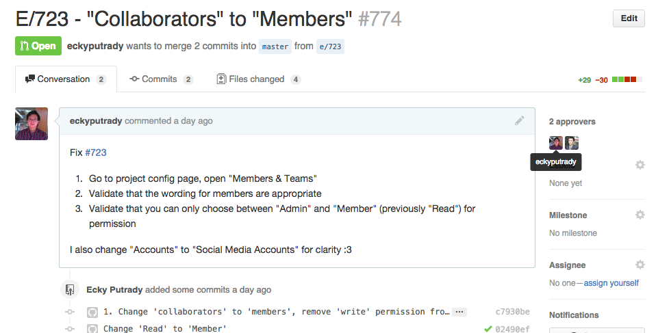
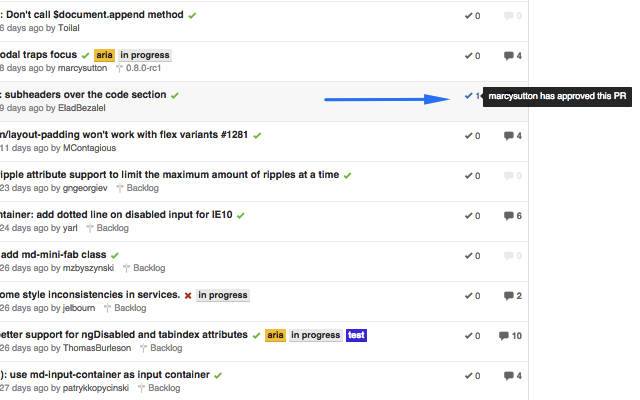

# Github Code Review


## Overview

Code review becomes easier with Github Code Review.

Github Code Review is a Chrome Extension that act as a lightweight code review tool on top of Github Pull Request. It let's you see who has approved each pull request easily.

Approve pull request by commenting with the following keywords/emojis:

- :+1:
- :shipit:
- verified
- approve

## Demo

See who has approved this Pull Request:



Approve count information for each Pull Request:



## How To Install

1. Install from [Chrome Webstore](https://chrome.google.com/webstore/detail/github-code-review/pgdgcfbmpimnnafmejbbgodlijodgppk)
2. The extension works when you open Github ;)

## License

[GNU GPL v2.0](LICENSE)

## Credits

1. App's icon is created Christopher Holm-Hansen from the Noun Project

## Developer's Guide

1. Setup the project
```
cd <project folder>
npm install
gulp
```
2. Open [Chrome Extensions menu](chrome://extensions/) using Google Chrome
3. Tick "Developer mode"
4. Click "Load Unpacked Extension" and choose `dist` folder
5. Run `gulp` and refresh Chrome Extensions menu if you change anything in the code
6. If you ready to publish the app, run `gulp prod` and get the `.zip` file under `package` folder